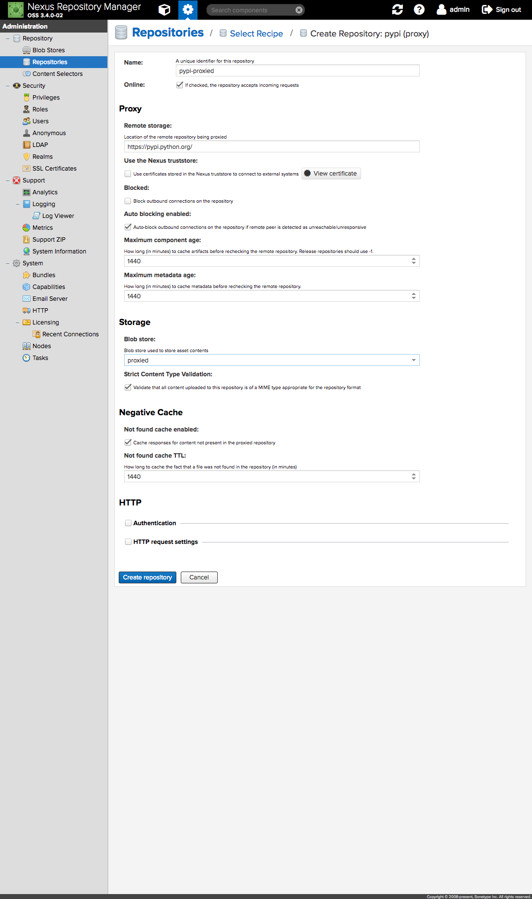
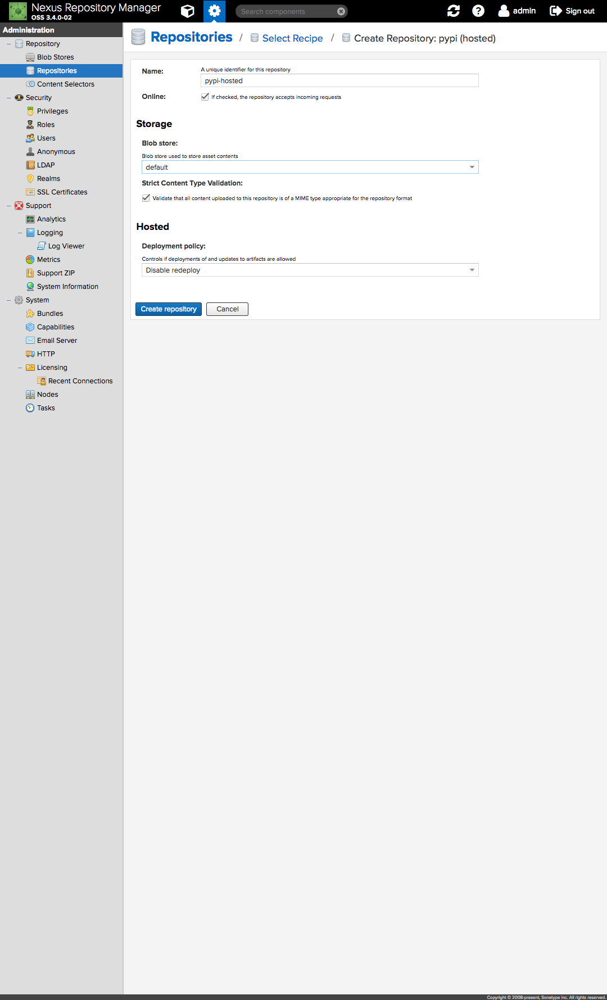
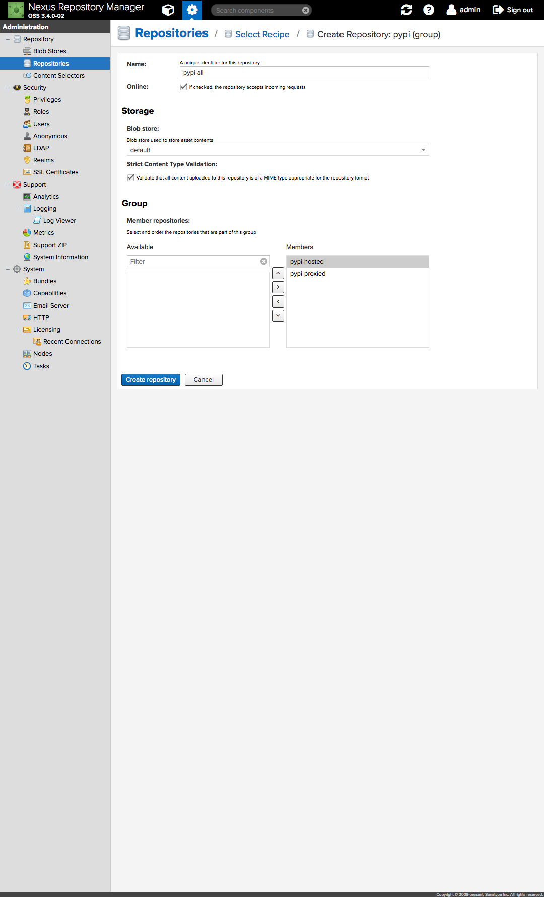

# Configuring Nexus

## Table of Contents

* [Reset administrative user](#change-credentials)
* [Create a blob store to host proxied artifacts](#create-proxy-repo)
* [Configure `maven-central` proxy to use the `proxied` blob store](#maven-central-proxy)
* [Configure the `docker-hosted` repository](#docker-hosted)
* [Configure the `pypi-all` repository group](#pypi-all)
* [Configure backup tasks and create backup scripts](#configure-backup)

<a id ="change-credentials">

## Reset administrative user

One is to log-in as `admin` (the default password is `admin123`) and head over
to _Administration/Security/Users_.
Click the `admin` user and change its password by pointing to
_More > Change password_. Make sure to change the email address as well.

<a id="create-proxy-repo">

## Create a blob store to host proxied artifacts

Nexus comes pre-configured with a `default` blob store which is used by all
repositories. Since this blob store is backed-up periodically, it is
recommended to create a new blob store to host proxied/cached artifacts that do
not require backup (e.g., those coming from Maven Central).

In order to do so, one is to head over to _Administration/Blob Stores_, click
_Create blob store_ and configure the new blob store as follows:

Finally, one is to click _Create blob store_ to finish the process.

<a id="maven-central-proxy">

## Configure `maven-central` proxy to use the `proxied` blob store

Once the `proxied` blob store is created, one must configure the `maven-central`
proxy to use the new blob store. Unfortunately it is not possible to change the
blob store associated with an already existing repository, so one must delete
the `maven-central` repository and re-create it.

In order to do so, one is to head over to _Administration/Repositories_,
click _Create repository_, choose the `maven2 (proxy)` recipe and configure it
as follows:

One is to make sure to choose `proxied` as the underlying blob store.

After re-creating the `maven-central` repository, it is necessary to edit the
`maven-public` group. In order to do so, one is to head over to `maven-public`
and add `maven-central` to the list of _Member repositories_ as follows:

<a id="docker-hosted">

## Configure the `docker-hosted` repository

For using Nexus as a Docker registry, an hosted repository must be created.
In order to do so, one is to head over to _Administration/Repositories_, click
_Create repository_, choose the `docker (hosted)` recipe and configure it
as follows:

One is to make sure to choose `5003` as the port for the HTTP connector and
`default` as the underlying blob store.
Finally, one is to click _Create repository_ to finish the process.

<a id="pypi-all">

## Configure the `pypi-all` repository group

For Nexus to act as a repository for Python software, it is necessary to
create a `pypi-all` virtual repository that will group two other repositories:
* `pypi-proxied` repository, which will proxy packages from
[PyPI](https://pypi.python.org/pypi), and
* `pypi-hosted` repository, which will host private (our own) packages.

### Configuring `pypi-proxied`

One is to head over to _Administration/Repositories_, click _Create repository_,
choose the `pypi (proxy)` recipe and configure it as follows:

One is to make sure to choose `proxied` as the underlying blob store.
Finally, one is to click _Create repository_ to finish the process.

### Configuring `pypi-hosted`

One is to head over to _Administration/Repositories_, click _Create repository_,
choose the `pypi (hosted)` recipe and configure it as follows:

One is to make sure to choose `default` as the underlying blob store.
Finally, one is to click _Create repository_ to finish the process.

### Configuring `pypi-all`

One is to head over to _Administration/Repositories_, click _Create repository_,
choose the `pypi (group)` recipe and configure it as follows:

One is to make sure to choose `default` as the underlying blob store.
Finally, one is to click _Create repository_ to finish the process.

<a id ="configure-backup">

## Configure backup tasks and create backup scripts

For the implemented backup process to work as expected, one must create a couple
of periodic tasks.

**Attention**: Nexus provides default intervals, e.g. daily, but also supports
[CRON notation](https://en.wikipedia.org/wiki/Cron) for advanced configuration.
While this tool tries to amenize any misconfigurations, __be warned that erroneous
cron expressions may lead to corrupt backups or even no backups at all__.

>One clear example of this was one tester who wanted thirty (30) minute intervals
between backups, defined the cron expression as `* */30 * * *` instead of
`0 0/30 * * *`. This resulted in a backup process being queued every second,
instead.
For more details check [Configuring and Executing Tasks](https://help.sonatype.com/display/HSC/Configuration+-+NXRM+3#Configuration-NXRM3-ConfiguringandExecutingTasks).

The first task, called `backup-1`, is responsible for triggering the backup
procedure itself.
In order to create it, one is to head over to _Administration/Tasks_, click
_Create task_, choose _Execute script_ and proceed as detailed below:

In this example, Nexus will `touch` the `/nexus-data/backup/.backup` file everyday
at 4am UTC, triggering the backup process - there's a process monitoring this
file that reacts to changes and starts the process.

The second task, called `backup-2`, is responsible for backing-up the Nexus
databases, configurations and metadata.
In order to create it, one is to head over to _Administration/Tasks_, click
_Create task_, choose _Export configuration & metadata for backup_ and proceed
as detailed below:

In this example, Nexus will backup its internal databases everyday at 4am UTC.
The abovementioned process waits for the task to complete and includes the
resulting file in the backup bundle.
